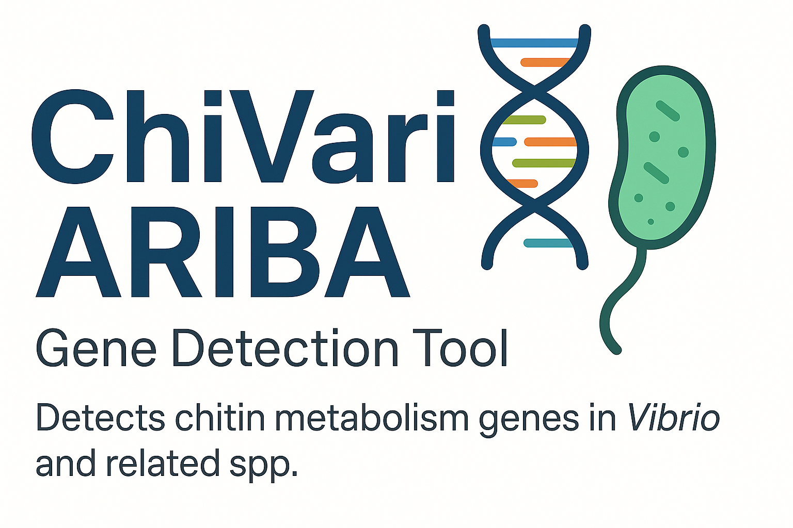

<p align="center">
  
</p>

<p align="center">
  <a href="https://www.python.org/"></a>
  <a href="https://www.gnu.org/software/bash/"></a>
  <a href="https://creativecommons.org/licenses/by/4.0/"></a>
</p>

# ChiVariARIBA

Chitin Metabolism Pathway Gene Identification By Assembly Using ARIBA.

This resource was developed to allow the user to effectively identify chitin metabolism pathway components in Vibrios and other related species using paired-end sequencing reads as input.

For how to use ARIBA, please see the [ARIBA wiki page][ARIBA wiki]. *THIS README.md FILE HAS BEEN ADAPTED WITH MODIFICATIONS FROM THE ARIBA README.md FILE*

## Contents
* [Introduction](#introduction)
* [Preparing ChiVariARIBA reference sequences](#Preparing-ChiVariARIBA-reference-sequences)
* [Quick Start](#quick-start)
* [Output](#output)
* [ARIBA Installation](#installation)
  * [Required dependencies](#required-dependencies)
  * [Using pip3](#using-pip3)
  * [From Source](#from-source)
  * [Docker](#docker)
  * [Singularity](#singularity)
  * [Debian (testing)](#debian-testing)
  * [Ubuntu](#ubuntu)
  * [Dependencies and environment variables](#dependencies-and-environment-variables)
* [Temporary files](#temporary-files)
* [Usage](#usage)
* [Citation](#citation)

## Introduction
ChiVariARIBA is a tool that identifies genes encoding chitin metabolism pathway components by running local assemblies. It utilises the ARIBA tool that was originally developed to identify antibiotic resistance genes

The input is a FASTA file of reference sequences (we have compiled these chitin metabolism pathway genes carefully from the literature) and paired sequencing reads. ChiVariARIBA reports which of the reference sequences were found, plus detailed information on the quality of the assemblies and any variants between the sequencing reads and the reference sequences.

## Preparing ChiVariARIBA reference sequences
We used a quality-controlled collection of 241 annotated genome sequences, representative of the *Vibrio* genus and other related bacteria, to create the pangenome used as input for this workflow. Details of how these genomes were collated are available in the manuscript linked to this repository (see below).

From these annotated assemblies, a list of 189 genes exerimentally proven to be associated with chitin metabolism pathways in various species were identified. The list included genes for which experimental or functional evidence was available in the literature supporting their role in chitin metabolism (see linked manuscript). We extrapolated this carefully collated list to include variants of these genes which are inferred to have the same function through high BLAST percent identity. Representative gene sequences from the pangenome gene families which contained these reference/variant genes were collated into the ariba_chitin_genes.fasta file available in this repository. The fasta file header for each sequence corresponds to the unique gene clustering ID in the pangenome output (combined_DNA_CDS.fasta), and the annotation and accession number for the representative gene sequence is available in the ariba_metadata.tsv file in this repository. The metadata file also captures all of the sequence variation contained in the sequence alignment for each gene family. 

Additionally, because ChiVariARIBA contains both experimentally proven chitin gene sequences as well as variants of these sequences, if the tool detects one of the variant genes within a sample, it reports back how the identified sequence varies from the variant gene, and then also reports how this variant gene varies from the reference chitin gene sequence, in the form of Blast traceback operations (BTOP) strings (description below). 

When ARIBA is used with the ChiVariARIBA database, the presence and absence of all 189 representative gene families AND their inferred variants in read files will be reported.

## Quick Start
We have attached a pre-prepared database to this repository (ariba_database) which can be pulled down and ran independently with your selected input sequencing reads. However, we have also included the original .fasta and .tsv metadata file that were originally used to create ariba_database. You can recreate your own ariba_database using these files with the following command:

Prepare reference data for ChiVariARIBA:

    ariba prepareref -f ariba_chitin_genes.fasta -m ariba_metadata.tsv ariba_database

Run local assemblies and call variants:

    ariba run ariba_database reads_1.fastq reads_2.fastq ariba_output

where the `reads_1.fq`, `reads_2.fq` are the names of the forwards and reverse paired reads files. The reads files can be in any format that is compatible with [minimap](https://github.com/lh3/minimap) (in particular, gzipped).

Important: ARIBA assumes that read _N_ in the file `reads_1.fq` is the mate of read _N_ in the file `reads_2.fq`. All output files will be put in a new directory called `ariba_output`.

Collapse the output report so that each gene found represents one single line (please move the collapse_report.py script into the ariba_output directory before executing):

    python3 collapse_report.py
    
This produces ariba_collapsed_report.tsv which should contain all chitin metabolism pathway genes present in the input reads.

It is also possible to summarise data from several runs:

    ariba summary out.summary ariba_output1/ariba_collapsed_report1.tsv ariba_output2/ariba_collapsed_report2.tsv ariba_output2/ariba_collapsed_report2.tsv

Please read the [ARIBA wiki page][ARIBA wiki] for full usage instructions for ARIBA.

To see all the options, use `--help`:

    ariba run --help

## ARIBA Tutorials
[The Jupyter notebook tutorial](https://github.com/sanger-pathogens/pathogen-informatics-training)

## Output

After using the collapse_report.py script on the original ChiVariARIBA output file, you should have a collapsed report `(ariba_collapsed_report.tsv)` where one gene is reported per line. This tap-separated output file contains the following columns:

| Column                 | Description |
|------------------------|-------------|
| 1.  ariba_ref_name     | ariba name of reference sequence chosen from cluster (needs to rename to stop some tools breaking) |
| 2.  ref_name           | original name of reference sequence chosen from cluster, before renaming (in ChiVariARIBA, this should be exact same as previous column)| 
| 3.  gene               | 1=gene, 0=non-coding (same as metadata column 2) |
| 4.  var_only           | 1=variant only, 0=presence/absence (same as metadata column 3) |
| 5.  flag               | cluster flag |
| 6.  reads              | number of reads in this cluster |
| 7.  cluster            | name of cluster |
| 8.  ref_len            | length of database gene sequence |
| 9.  ref_base_assembled | number of database gene nucleotides assembled by this contig |
| 10.  pc_ident           | %identity between database gene sequence and contig |
| 11. ctg                | name of contig matching reference |
| 12. ctg_len            | length of contig |
| 13. ctg_cov            | mean mapped read depth of this contig |
| 14. known_var          | is this a known SNP from reference metadata? 1 or 0 |
| 15.  gff_file_of_gene   | The gff/assembly file that the database gene sequence originated from |
| 16.  scaffold_name      | the name of the chromosomal assembly within the gff file that the database gene sequence originated from |
| 17.  annotation/protein_id	| ID of the protein associated with this particular database gene |
| 18.  gene_name          | name of gene |
| 19.  gene_description/annotation	| annotated gene function description |
| 20.  panaroo_gene_family	| name of gene family that this gene was binned into by Panaroo (threshold: -f 0.6) |
| 21.  reference_gene_id		| name of `REFERENCE` chitin gene (experimentally-proven chitin genes found in the literature) that this gene was determined to be highly similar to (through BLAST) |
| 22.  pident_compared_to_reference	| percent identity of the database gene sequence compared to its associated `REFERENCE` chitin gene sequence |
| 23.  length             | length of database gene sequence |
| 24.  mismatches         | number of mismatches between database gene sequence and its associated `REFERENCE` chitin gene sequence |
| 25.  gapopen            | number of gaps open between database gene sequence and its associated `REFERENCE` chitin gene sequence |
| 26.  qstart             | query start (start of database gene sequence within its associated `REFERENCE` chitin gene sequence) |
| 27.  qend               | query end (end of database gene sequence within its associated `REFERENCE` chitin gene sequence) |
| 28.  sstart             | start of alignment in subject |
| 29.  send               | end of alignment in subject |
| 30.  evalue             | expect value between database gene sequence and its associated `REFERENCE` chitin gene sequence |
| 31.  bitscore           | bit score between database gene sequence and its associated `REFERENCE` chitin gene sequence |
| 32.  btop_mismatches    | Blast traceback operations (BTOP) strings are compact, human-readable representations of how a BLAST alignment matches and mismatches between query and subject sequences |
| 33. var_type           | The type of variant. Currently only SNP supported |
| 34. var_seq_type       | Variant sequence type. if known_var=1, n or p for nucleotide or protein |
| 35. known_var_change   | if known_var=1, the wild/variant change, eg I42L |
| 36. has_known_var      | if known_var=1, 1 or 0 for whether or not the assembly has the variant |
| 37. ref_ctg_change     | amino acid or nucleotide change between database gene and contig, eg I42L |
| 38. ref_ctg_effect     | effect of change between database gene and contig, eg SYS, NONSYN (amino acid changes only) |
| 39. ref_start          | start position of variant in database gene |
| 40. ref_end            | end position of variant in database gene |
| 41. ref_nt             | nucleotide(s) in database gene at variant position |
| 42. ctg_start          | start position of variant in contig |
| 43. ctg_end            | end position of variant in contig |
| 44. ctg_nt             | nucleotide(s) in contig at variant position |
| 45. smtls_total_depth  | total read depth at variant start position in contig, reported by mpileup |
| 46. smtls_nts          | nucleotides on contig, as reported by mpileup. The first is the contig nucleotide |
| 47. smtls_nts_depth    | depths on contig, as reported by mpileup. One number per nucleotide in the previous column |
| 48. var_description    | description of variant from metdata |

## Other files

The other files written to the output directory are as follows.

* `assembled_seqs.fa.gz`. This is a gzipped FASTA of the assembled sequences. During assembly, the sequence flanking each reference sequence is assembled, but in this file only the parts of the contigs that match the reference sequences are kept. Furthermore, since no filter of nucleotide identity or reference coverage is applied when generating this file, partial matches from contigs to reference sequences are also included.

* `assembled_genes.fa.gz`. This is a gzipped FASTA file of assembled gene sequences. It does not contain non-coding sequences (those are in `assembled_seqs.fa.gz`), only genes. When comparing a local assembly to a gene, mismatches near the end of the gene can cause the alignment to be too short. ARIBA tries to extend the match by looking for start and stop codons. The extended sequences are in this file, whereas the unextended sequences are in `assembled_seqs.fa.gz`.

* `assemblies.fa.gz`. This is a gzipped FASTA file of the assemblies. It contains the complete, unedited, contigs. Since flanking regions of each reference sequence is assembled, the contig is usually longer than its matching reference sequence. As a result, file sizes should often show the following relationship: `assemblies.fa.gz` > `assembled_genes.fa.gz` and `assembled_seqs.fa.gz`, and sometimes `assembled_seqs.fa.gz` > `assembled_genes.fa.gz`.

* `debug.report.tsv`. Not only does this file contain all rows of `report.tsv`, but also includes rows about synonymous mutations.

* `log.clusters.gz`. Detailed logging is kept for the progress of each cluster. This is a gzipped file containing all the logging information.

* `version_info.txt`. This contains detailed information on the versions of ARIBA and its dependencies. It is the output of running the task [[version|Task:-version]].

An example ariba_output directory is given in this repository. ChiVariARIBA was executed on a set of reads for a sample (ERR13299686 - [NCBI Sequence Read Archive - ERR13299686](https://www.ncbi.nlm.nih.gov/sra/?term=ERR13299686)). We then collapsed the report.tsv using collapse_report.py to produce ariba_collapsed_report.tsv. Please familiarise yourself on what the output file looks like and what each of the columns represent.

## ARIBA Installation

In order to use ChiVariARIBA, you must first install ARIBA. There are many ways to install and run ARIBA, and these are available on the ARIBA Github page - [sanger-pathogens/ariba](https://github.com/sanger-pathogens/ariba). We will describe some of the installation methods which work best with ChiVariARIBA below. If you encounter an issue when installing ARIBA please contact your local system administrator. If you encounter a bug you can log it [here](https://github.com/sanger-pathogens/ariba/issues).

### Required dependencies
  * [Python3][python] version >= 3.6.0
  * [Bowtie2][bowtie2] version >= 2.1.0
  * [CD-HIT][cdhit] version >= 4.6
  * [MUMmer][mummer] version >= 3.23

ARIBA also depends on several Python packages, all of which are available
via pip. Installing ARIBA with pip3 will get these automatically if they
are not already installed:
  * dendropy >= 4.2.0
  * matplotlib>=3.1.0
  * pyfastaq >= 3.12.0
  * pysam >= 0.9.1
  * pymummer >= 0.10.1
  * biopython

### Using pip3
Install ARIBA using pip:

    pip3 install ariba

### From Source
Download the latest release from this github repository or clone it. Run the tests:

    python3 setup.py test

**Note for OS X:** The tests require gawk which will need to be installed separately, e.g. via Homebrew.

If the tests all pass, install:

    python3 setup.py install

Alternatively, install directly from github using:

    pip3 install git+https://github.com/sanger-pathogens/ariba.git #--user

### Docker
ARIBA can be run in a Docker container. First install Docker, then install the latest
version of ARIBA:

    docker pull gchr.io/sanger-pathogens/ariba:latest

All Docker images are listed in the
[packages page](https://github.com/sanger-pathogens/ariba/pkgs/container/ariba).

To use ARIBA use a command like this (substituting in your directories), where your files are assumed to be stored in /home/ubuntu/data:

    docker run --rm -it -v /home/ubuntu/data:/data sangerpathogens/ariba ariba -h

When calling Ariba via Docker (as above) you'll also need to add **/data/** in front of all the passed in file or directory names (e.g. /data/my_output_folder).


### Singularity

ARIBA can be run in a Singularity container. First install Singularity.
[Releases](https://github.com/sanger-pathogens/ariba/releases) include
a Singularity image to download.

Alternatively, build your own Singularity image:

```
singularity build ariba.simg Singularity.def
```


### Debian (Ariba version may not be the latest)
ARIBA is available in the latest version of Debian, and over time will progressively filter through to Ubuntu and other distributions which use Debian. To install it as root:

    sudo apt-get install ariba

### Ubuntu
You can use `apt-get` (see above), or to ensure you get the latest version of ARIBA, the following commands can be
used to install ARIBA and its dependencies. This was tested on a new instance of Ubuntu 16.04.

    sudo  apt-get update
    sudo apt-get install -y python3-dev python3-pip python3-tk zlib1g-dev bowtie2 mummer cd-hit
    export ARIBA_CDHIT=cdhit-est
    sudo pip3 install ariba

### Dependencies and environment variables

By default, ARIBA will look for the dependencies in your `$PATH`, using
the names in the table below. This behaviour can be overridden and
point ARIBA to a specific program using environment variables.
The environment variable is checked first and is used if it is set.
Otherwise ARIBA looks in your `$PATH` for the default name. This applies
to the following dependencies.

| Dependency     |  Default executable    | Environment variable name |
|----------------|------------------------|---------------------------|
| Bowtie2        | `bowtie2`              | `$ARIBA_BOWTIE2`          |
| CD-HIT (est)   | `cd-hit-est`           | `$ARIBA_CDHIT`            |


For example, you could specify an exact version of a bowtie2 executable
that you compiled and downloaded in your home directory (assuming BASH):

    export ARIBA_BOWTIE2=$HOME/bowtie2-2.1.0/bowtie2

Note that ARIBA also runs `bowtie2-build`, for which it uses the
`bowtie2` executable with `-build` appended. So in this case
it would try to use

    $HOME/bowtie2-2.1.0/bowtie2-build

## Temporary files

ARIBA can temporarily make a large number of files whilst running, which
are put in a temporary directory made by ARIBA.  The total size of these
files is small, but there can be a many of them. This can be a
problem when running large numbers (100s or 1000s) of jobs simultaneously
on the same file system.
The parent directory of the temporary directory is determined in the
following order of precedence:

1. The value of the option `--tmp_dir` (if that option was used)
2. The environment variable `$ARIBA_TMPDIR` (if it is set)
3. The environment variable `$TMPDIR` (if it is set)
4. If none of the above is found, then use the run's output directory.

Each temporary directory
is unique to one run of ARIBA, and is automatically deleted at the end
of the run (even if ARIBA was killed by the user or crashed).
For example,

    export $ARIBA_TMPDIR=/tmp

will result in the creation of a new directory inside `/tmp`, which
will have a name of the form

    /tmp/ariba.tmp.abcdef

where the suffix `abcdef` is a random string of characters, chosen
such that `/tmp/ariba.tmp.abcdef` does not already exist.

The exception to the above is if the option `--noclean` is used.
This forces the temporary directory to be placed in the output
directory, and temporary files are kept. It is intended for
debugging.

## Usage
    usage: ariba <command> <options>

    optional arguments:
      -h, --help      show this help message and exit

    Available commands:

	aln2meta      Converts multi-aln fasta and SNPs to metadata
	expandflag    Expands flag column of report file
	flag          Translate the meaning of a flag
	getref        Download reference data
	micplot       Make violin/dot plots using MIC data
	prepareref    Prepare reference data for input to "run"
	pubmlstget    Download species from PubMLST and make db
	pubmlstspecies
		      Get list of available species from PubMLST
	refquery      Get cluster or sequence info from prepareref output
	run           Run the local assembly pipeline
	summary       Summarise multiple reports made by "run"
	test          Run small built-in test dataset
	version       Get versions and exit

Please read the [ARIBA wiki page][ARIBA wiki] for full usage instructions.

## Citation
ChiVariARIBA: A modular, editable workflow and database for characterising chitin gene variation in *Vibrio* spp. and related bacteria 
Naughton EP, Dorman MJ. (Manuscript in review)

ARIBA: rapid antimicrobial resistance genotyping directly from sequencing reads
Hunt M, Mather AE, Sánchez-Busó L, Page AJ, Parkhill J , Keane JA, Harris SR.
Microbial Genomics 2017. doi: [110.1099/mgen.0.000131](http://mgen.microbiologyresearch.org/content/journal/mgen/10.1099/mgen.0.000131)


  [ariba biorxiv]: http://biorxiv.org/content/early/2017/04/07/118000
  [bowtie2]: http://bowtie-bio.sourceforge.net/bowtie2/index.shtml
  [cdhit]: http://weizhongli-lab.org/cd-hit/
  [ARIBA wiki]: https://github.com/sanger-pathogens/ariba/wiki
  [mummer]: http://mummer.sourceforge.net/
  [python]: https://www.python.org/

NOTE: The cover image used in this README.md file was generated using OpenAI's DALL·E via ChatGPT.

